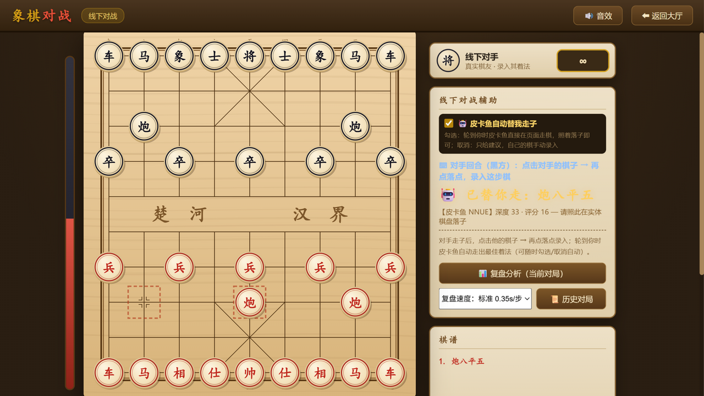
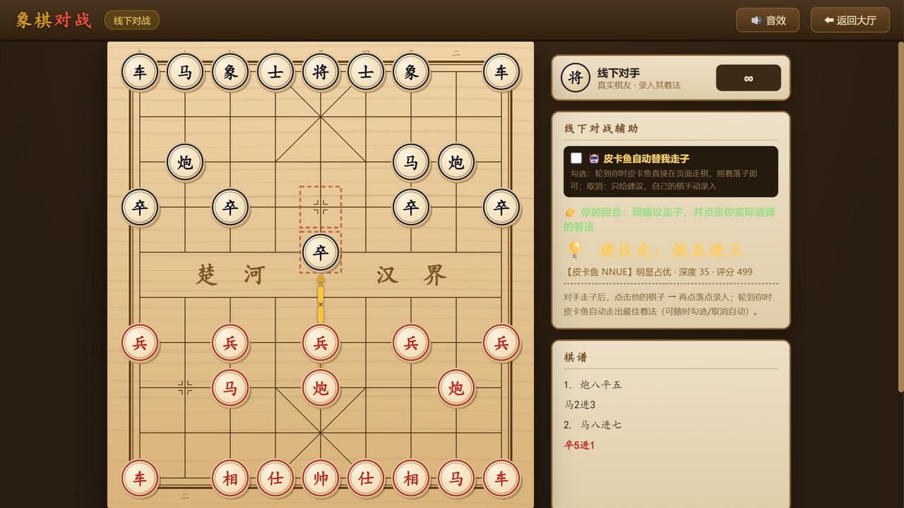
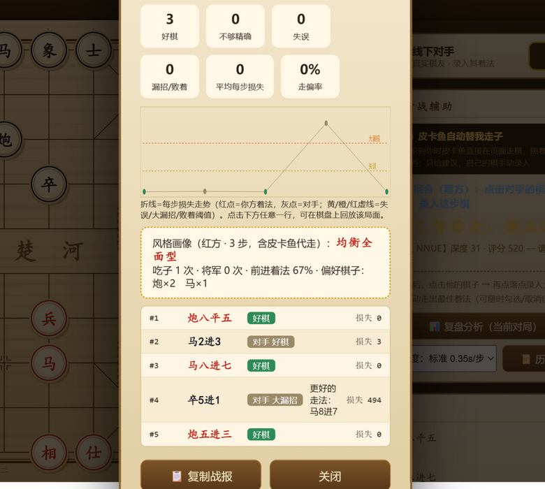
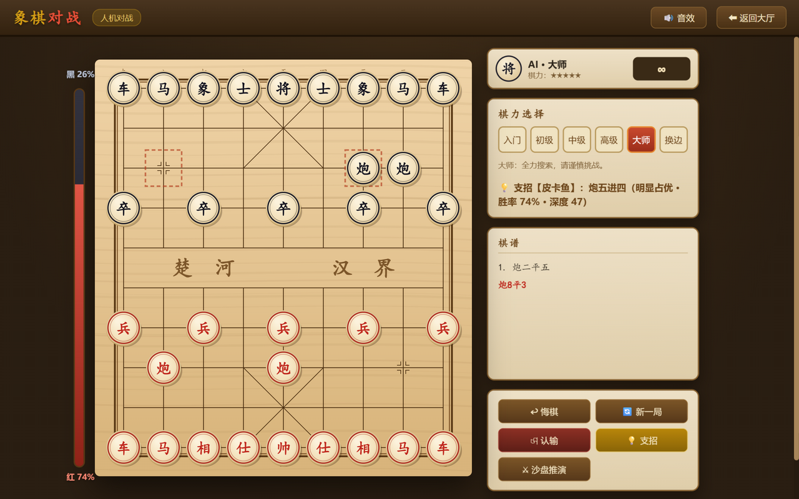
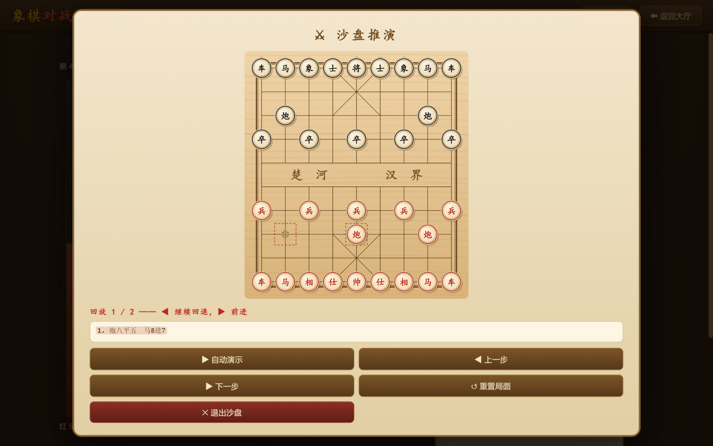
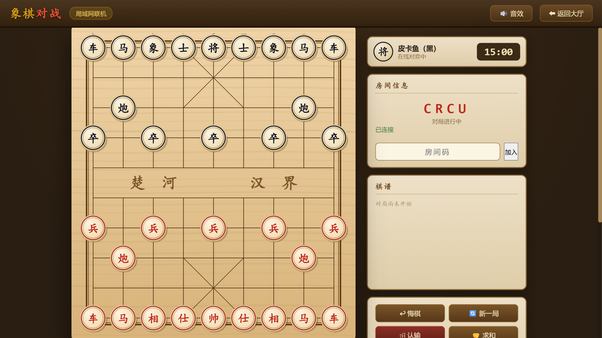
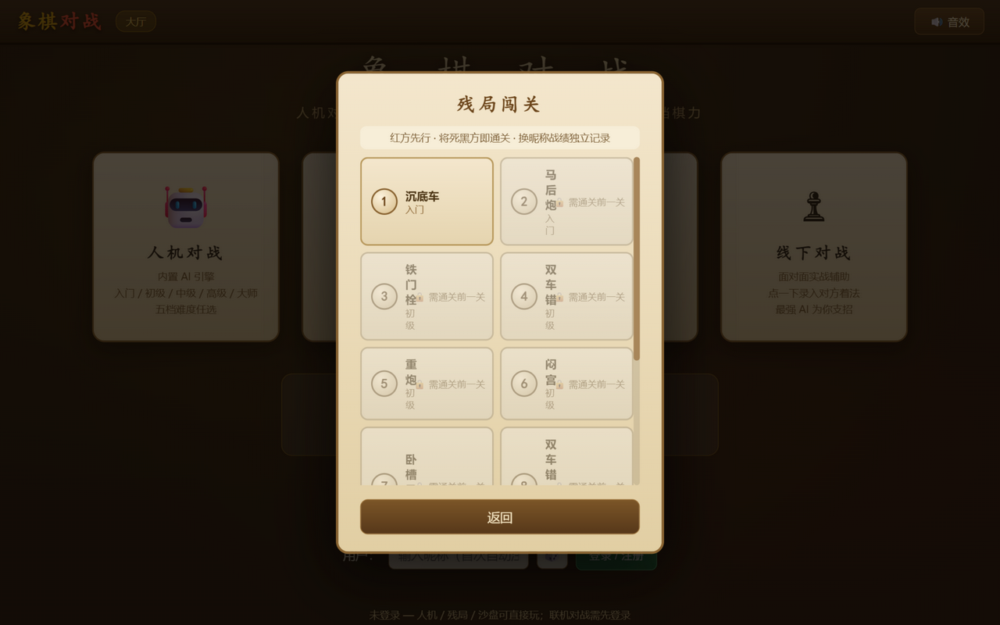
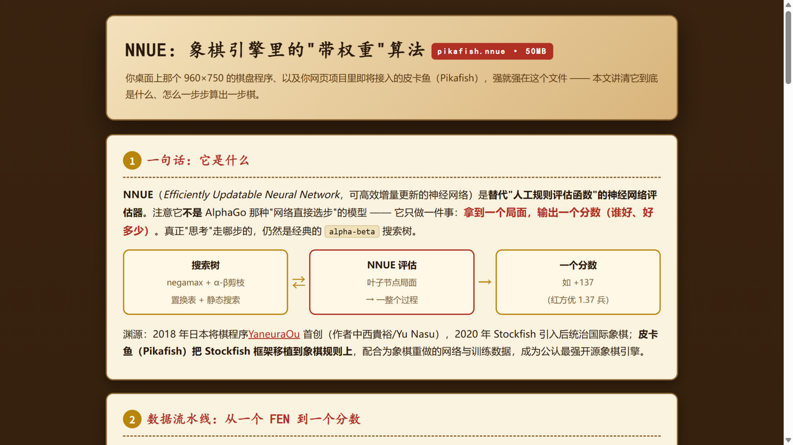

# 🎯 象棋对战 · 线下实体棋"最强军师"

> **把 27,000,000 个训练出来的参数装进你的浏览器旁边，面对面下实体棋时，它替你算每一步、替你复盘每一手。**

这是一个零依赖的网页版中国象棋平台。它的招牌功能是**线下对战辅助**：和朋友面对面下实体棋盘时，把对方的着法点进屏幕，**皮卡鱼（Pikafish，最强开源象棋引擎）就会直接在页面上替你走出最佳应手**——照着落子就行。下完之后，还有**逐着复盘 + 漏招分析 + 风格画像**，告诉你哪几步走错了、错在哪、应该怎么走。除此之外还有**人机对战、局域网联机、残局闯关、沙盘推演**等完整玩法（见[五种玩法全覆盖](#-不止线下五种玩法全覆盖)）。



---

## ✨ 核心玩法：线下对战辅助（2 分钟上手）

**适用场景**：和朋友面对面下实体象棋，你想赢，也想赛后知道自己下得怎么样。

### 第 1 步：开局

大厅点「♟ 线下对战」，选你执红（先行）或执黑（后行）。屏幕棋盘 = 实体棋盘的镜像。

### 第 2 步：录入对手的着法

对手在实体棋盘上走一步后，你在屏幕上**点他的棋子（起点）→ 再点落点**，这步棋就录入了。

### 第 3 步：皮卡鱼替你走

录入完成后约 2.5 秒，皮卡鱼（NNUE 权重全量加载）算出最佳应手，**直接在页面棋盘上替你走那一步**——带走子动画、音效、自动记谱，面板显示着法、深度与评分。你照着在实体棋盘落子即可。

```text
你：录入对手着法 ──► 皮卡鱼计算(2.5s) ──► 页面自动替你走 ──► 你照着落子
        ▲                                                    │
        └────────────────── 对手再走，循环 ◄──────────────────┘
```

### 第 4 步：下完复盘

对局结束（或随时）点「📊 复盘分析」→ 见下文[复盘分析](#-复盘分析jj-象棋风格逐着审判)。

### 两种模式，随时切换

| 模式 | 行为 | 适合 |
|---|---|---|
| 🤖 **自动替走**（默认） | 皮卡鱼算完直接替你在页面走棋 | 你只想照着落子、专心博弈 |
| ✍️ **手动录入** | 只画建议箭头，你走完点击实际着法记录 | 开局想按自己想法走 / 想检验真实水平 |



其他细节：点错可「悔棋」（自动模式悔棋后暂停，出「🤖 重算并替走」按钮由你确认）；左侧有**实时局势条**（红优/黑优一目了然）；将死有按杀法分类的全屏演出。

---

## 📊 复盘分析：JJ 象棋风格逐着审判

对局结束（或对局中随时）进入复盘，皮卡鱼会对**每一个局面**重新分析，然后给出一份完整战报：



- **逐着对比**：你的每一步和皮卡鱼推荐的着法对比，算出"损失分"，按 JJ 象棋习惯分级——**好棋 / 正常 / 不够精确 / 失误 / 大漏招 / 败着**
- **更好的走法**：失误以上的每一步，直接写明皮卡鱼认为更好的着法
- **损失曲线图**：折线一目了然哪几个回合开始崩盘（红点=你方，灰点=对手，虚线=失误阈值）
- **风格画像**：激进进攻型 / 稳健防守型 / 均衡全面型 + 吃子/将军次数、前进着法占比、最常用棋子
- **回放模式**：点击战报任意一行，棋盘跳到那个局面，◀▶ 逐着翻看，边看边学
- **📋 复制战报**：一键复制文字版，发给朋友或存档

复盘速度可选：快速(0.2s/步) / 标准(0.35s/步，默认) / 深算(1s/步)。

### 📜 历史对局与成长曲线

每一局复盘自动存档（本机 localStorage，最近 40 局）。「📜 历史对局」页面可以看到**走偏率成长曲线**——你的进步，量化可见。

---

## 🕹 不止线下：五种玩法全覆盖

除了线下辅助，整套平台还自带完整的电子象棋玩法——单机、联机、闯关都有：

### 🤖 人机对战：五档内置引擎陪练

大厅点「🤖 人机对战」，入门到大师五档任选（入门会主动送子，大师全力搜索）。随时点「💡 支招」请皮卡鱼画箭头指路，左侧局势条实时显示**红黑双方胜率**；下完还能进入复盘对比。



### ⚔ 沙盘推演：杀招演算室

任何模式点「⚔ 沙盘推演」，当前局面会被搬进一块独立棋盘：

- **▶ 自动演示**：逐着走出皮卡鱼给出的绝杀路线，路线播完自动转入引擎互弈
- **◀ ▶ 逐步回放**：演示中和结束后都能一步一步回退/前进细看，**点击棋谱任意一行**直接跳到那个局面
- **亲手试杀**：自己落子进攻，皮卡鱼实时防守；它若算出 N 步内被将死会直接宣告



### 🌐 局域网联机：和同事真人对弈

输入昵称即自动注册登录（零门槛）。房间列表实时可见，建房后**一键复制邀请链接**发给朋友，打开链接自动入房；双方点「准备」开局。支持断线自动重连、实时聊天、每方 15 分钟计时；人不够时还能**添加皮卡鱼电脑对手**补位。



### 🧩 残局闯关：十大经典杀法

沉底车、马后炮、铁门栓、双车错、重炮、闪宫、卧槽马……由浅入深 10 关，通关解锁下一关。你执红进攻，皮卡鱼执黑全力防守——练的都是实战杀技；换昵称战绩独立记录。



### 🏆 战绩统计

大厅首页按昵称显示人机/联机/残局三维战绩与胜率，赢没赢、赢多少，一目了然。

---

## 🧠 原理：50MB 的权重文件是怎么变成棋力的

整套系统三层结构，各干各的：

```text
┌──────────────┐   HTTP    ┌─────────────┐   UCI 文本   ┌──────────────────┐
│  浏览器页面   │ ────────► │ node 服务器  │ ───────────► │  pikafish.exe    │
│  棋盘/记谱/特效│ ◄──────── │ (server.js) │ ◄─────────── │  加载 pikafish.nnue│
└──────────────┘  JSON 着法 └─────────────┘  bestmove    └──────────────────┘
                                                    NNUE 神经网络推理（C++/SIMD）
```

- **pikafish.exe + pikafish.nnue（50MB）**：NNUE（Efficiently Updatable Neural Network）是一种"可高效增量更新"的神经网络评估器。它**不直接选步**，只做一件事：把局面变成一个精确到分的评估值。每个棋子按"类型×位置×本方将的位置"编码成特征索引，查 2560 维权重向量累加，经隐藏层输出分数——走一步棋只需增删两个特征向量，微秒级完成。权重由 Pika Xiangqi Zero 团队用数亿个自对弈局面训练而成。
- **搜索框架**：皮卡鱼的搜索骨架（迭代加深 / α-β 剪枝 / 置换表 / 静态搜索）与你项目内置引擎**同源同构**——差距全在"评估的眼睛"和工程打磨上。
- **我们自己写的部分**：`public/js/rules.js`（完整象棋规则引擎：蹩马腿/塞象眼/白脸将/困毙/60 回合和棋……）、`public/js/engine.js`（手写 negamax 引擎，充当教学级对手）、`tools/pikafish-uci.js`（UCI 子进程桥接，含队列/降级/自动重启）、`server.js` 里的房间与 AI 对手逻辑（零 npm 依赖）。

想深入看 NNUE 的完整原理？项目里附带了一篇图解长文，服务器开着时访问 **`/nnue-intro.html`**：



---

## 📈 棋力分析：实测基准

用 `tools/` 下的基准脚本实测（双方交替执红黑）：

| 对决 | 条件 | 结果 |
|---|---|---|
| 内置中级 vs 内置大师 | 600ms vs 2600ms | 大师 **6 : 2** 中级 |
| 内置大师 vs xqwlight（2012 年 JS 引擎） | 2600ms vs 1500ms | 大师 **0胜1和3负** |
| 内置大师 vs **Pikafish** | 2600ms vs **500ms**（1/5 时间） | 大师 **0 : 4**，全被将死 |
| 内置大师 vs **Pikafish** | **等时 1000ms** | 大师 **0 : 4**，全被将死 |
| **Pikafish 自对弈**（12线程 vs 12线程） | 500~950ms/步 × 4 局 | **4 局全和**，评估全程 ≤±0.06 兵 |
| **Pikafish 升级前 vs 升级后** | 同思考时间 × 8 局 | **8 局全和**（详见下节） |

搜索深度对比（同一局面）：内置引擎 2.6 秒 ≈ **6~8 层**；皮卡鱼 0.8 秒 ≈ **40~42 层**（升配后，此前 27 层）。

结论：内置引擎适合当教学陪练；**真正的棋力来自皮卡鱼的 NNUE 权重**。你自己下棋的水平，可以在复盘中和它逐步对比——损失分就是你和"上帝视角"的差距。

> 💡 **为什么照着皮卡鱼走，胜率条却一直持平？** 上面前两行就是答案：只要对方也没犯错（不管他是棋力好，还是也在用支招工具），两个"零失误"之间永远是均势和棋。皮卡鱼各种形态互殴 12 局无一分胜负——你只要逼出对手一次失误，胜率条立刻拉开。

---

## 🔧 引擎配置与升级

**当前配置**（`server.js` 启动时自动按机器分配）：

- 引擎版本：**Pikafish 2026-09-06**（官方最新，NNUE 权重随仓库分发）
- 线程：`逻辑核数 − 4`（在 8 核 16 线程的机器上为 **12 线程**，自动留给系统/浏览器 4 核）
- 置换表：**2GB**

**升级效果实测**（同一局面、同样思考时间，只换线程/内存配置）：

| 思考时间 | 旧配置（1线程/128MB） | 新配置（12线程/2GB） |
|---|---|---|
| 800ms | 深度 d27 | **d40**（线上 API 实测 d42） |
| 2500ms | 深度 d36 | **d51** |

同时间多看 **13~15 层**，对人类对手是质变：漏算、深算计（长将/闷杀类骗招）被识破的概率大幅下降，复盘分析也更精确。

**升级前 vs 升级后正面对决**（`tools/bench-pikafish-upgrade-match.js`，同思考时间、交替先后手）：慢棋 4 局 + 快棋 4 局 **全部和棋**，1280 步评估从未离开 ±75 厘兵。原因很直白：升级只是给同一个 NNUE"大脑"配了更好的算力，棋感知识完全相同——1 线程版在 500ms 下也能搜到 d31+，多线程收益按对数增长（实战约 +4~6 层）。**升级的收益体现在对人场景**（对手犯错会被更深的搜索清算），而不是引擎互殴。

**自己动手复现**：

```bash
node tools/bench-pikafish-vs-pikafish.js 4 500        # 双实例自对弈（逐着输出评估/深度）
node tools/bench-pikafish-upgrade-match.js 4 500      # 升级前 vs 升级后对决
```

日志会完整记录每一着的中文名、双方评估和搜索深度；160 步未分胜负时按最后评估裁决（≥600 厘兵判胜，否则和）。

---

## 🚀 快速开始（给别人用）

**环境要求**：Windows + [Node.js](https://nodejs.org)（任意近期版本，项目零 npm 依赖）。

```bash
git clone https://github.com/daihengdh/XiangQi-online.git
cd XiangQi-online
```

双击 **`start.bat`**，浏览器打开提示的地址（默认 `http://localhost:8080`）。

- 皮卡鱼引擎 `pikafish.exe` 与 NNUE 权重 `pikafish.nnue` **已随仓库附带，克隆即用**
- 首次运行会自动在后台拉起皮卡鱼进程（控制台出现 `[Pikafish] 引擎已就绪` 即成功）
- 若权重文件缺失，服务器自动降级为内置引擎，其余功能不受影响（补回方式见 `engines/pikafish/获取权重说明.md`）
- **手机也能用**：同一局域网内用手机浏览器打开局域网地址即可（窄屏自动切换单列布局）

### 外网对战（可选）

双击 `start-public.bat`，首次会自动下载 cloudflared 内网穿透工具，随后给出一个临时公网地址——把地址发给朋友，异地也能联机对战。

---

## 🗂 功能总览

| 功能 | 说明 |
|---|---|
| ♟ **线下对战辅助** | 实体棋镜像 + 皮卡鱼自动替走/支招 + 实时局势条（红黑双方胜率%） + 悔棋暂停保护 |
| ⚔ **沙盘推演** | 独立棋盘：绝杀路线自动演示、◀▶ 逐步回放、点击棋谱跳转、亲手试杀（皮卡鱼实时防守） |
| 📊 **复盘分析** | 逐着对比皮卡鱼、JJ 风格分级、损失曲线、风格画像、局面回放、复制战报 |
| 📜 **历史对局** | 最近 40 局自动存档，随时回看战报与回放，走偏率成长曲线 |
| 🤖 **人机对战** | 五档内置引擎难度（入门→大师），实时局势评估条 |
| 🌐 **局域网联机** | 登录注册 / 房间列表 / 准备开局 / 一键复制邀请链接 / 断线重连 / **可添加皮卡鱼电脑对手** / 聊天 / 计时 |
| 🧩 **残局闯关** | 十大经典杀法关卡，通关解锁 |
| 🏆 **战绩统计** | 按昵称区分，人机/联机/残局三维统计 |
| 🎆 **JJ 象棋风格特效** | 按杀法分类的绝杀演出（重炮/马后炮/卧槽马…11 类）、程序化音效 |
| 📱 **手机适配** | 窄屏自动单列布局，棋盘缩放，触屏可正常录入着法 |

---

## 📁 项目结构

```text
象棋对战/
├── server.js               # 零依赖服务器：静态文件 + WebSocket 房间 + 皮卡鱼托管 (/api/bestmove)
├── start.bat               # 本机/局域网一键启动
├── start-public.bat        # 外网穿透一键启动
├── public/                 # 网页端（单页应用）
│   ├── index.html          # 大厅 / 人机 / 联机 / 残局 / 线下辅助 五场景
│   ├── nnue-intro.html     # NNUE 原理图解长文（推荐阅读！）
│   ├── css/  js/           # 样式与全部逻辑（rules.js 规则引擎 / engine.js 内置 AI / app.js 主控 …）
│   └── ...
├── engines/
│   ├── pikafish/           # 皮卡鱼引擎 + NNUE 权重（已随仓库分发，克隆即用）
│   └── xqwlight/           # 象棋巫师轻量版 JS 引擎（备用对比引擎）
├── tools/                  # 自研工具：pikafish-uci.js 桥接 / 五个引擎基准脚本（含自对弈、升级前后对决） / 线下续战脚本
├── test/                   # 57 项自动化测试（规则 26 / 引擎 20 / 服务器 11）
└── docs/                   # 截图
```

---

## ⚠️ 使用边界

这个工具的设计初衷是**线下娱乐对局的随身军师 + 自我提升的复盘教练**——和朋友开玩笑"开挂"、赛后研究自己的漏洞，都是它存在的意义。

但请勿把它用在任何**线上平台**的对局中作弊：一来违反平台规则，二来那也失去了下棋的乐趣。

## 许可说明

- `public/`、`server.js`、`tools/` 等自研代码版权归项目作者
- `engines/pikafish/` 内的皮卡鱼引擎与 NNUE 权重基于 [GPL-3.0](engines/pikafish/Copying.txt) 分发（来源：[official-pikafish/Pikafish](https://github.com/official-pikafish/Pikafish)），权重另受 [NNUE-License.md](engines/pikafish/NNUE-License.md) 约束
- `engines/xqwlight/` 基于 [GPL-2.0](engines/xqwlight/LICENSE)（来源：[xqbase/xqwlight](https://github.com/xqbase/xqwlight)）
